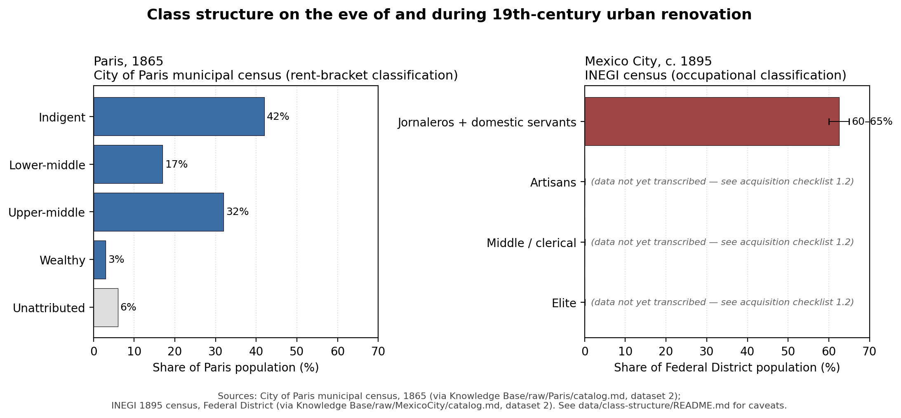

# Figure 1 — Paired Class Structure: Paris 1865 vs. Mexico City c. 1895



Two-panel horizontal bar chart showing the class composition of the two cities during their respective 19th-century urban renovations, at the level of detail currently supported by `raw/`. This is figure 1 of both the Paris and Mexico City pipelines described in `raw/Paris/catalog.md` and `raw/MexicoCity/catalog.md`.

## What the figure shows

**Paris panel (1865, City of Paris municipal census, rent-bracket classification).** Four named classes: Indigent (42%), Lower-middle (17%), Upper-middle (32%), Wealthy (3%). A fifth grey bar labeled "Unattributed" carries the 6% residual because the four catalog-given shares sum to 94%, not 100%.

**Mexico City panel (c. 1895, INEGI census, occupational classification).** Only the *Jornaleros + domestic servants* bar is filled, shown as the 60–65% range the catalog reports (with an error bar capturing the interval). Three empty slots — Artisans, Middle / clerical, Elite — are rendered explicitly with italicized notes ("data not yet transcribed — see acquisition checklist 1.2") so the data gap is visible rather than concealed.

## How to read it honestly

- The two panels share an x-axis (0–70%) but **do not share a classification scheme**. Paris is by annual rent bracket; Mexico City is by occupation. The comparison is directional (a large low-status bottom bar in both cases) rather than strictly like-for-like. Any caption or slide text must name this.
- The Paris "Indigent" bar (42%) and the Mexico City "Jornaleros + domestic servants" bar (60–65%) are the two numbers the thesis actually relies on at this stage — both are low-status majorities, and the Mexico City number is strictly larger. The full paired comparison (with the Mexican artisan / middle / elite bars filled in) is gated on acquisition-checklist priority 1.2.
- The grey "Unattributed" bar on the Paris side is **not** a second data gap — it is a real residual in the underlying 1865 figures, likely covering transients, institutionalized populations, and household members not classified under the rent-bracket scheme. Carrying it explicitly is more honest than silently rescaling to 100%.

## What the figure supports

This figure is the visual anchor for the baseline-class-structure row of the dataset-by-dataset table in [[comparative-mechanism]]. It demonstrates:

1. Both cities entered their renovations as overwhelmingly working-class/poor populations (42% indigent in Paris; 60–65% jornaleros + servants in Mexico City).
2. The wealthy were a tiny minority in Paris (3%); the Mexico City elite share is not yet quantified.
3. The directional parallel the project's thesis depends on is visible at this resolution; the strictly paired comparison is not yet.

## What the figure does *not* support

- No claim about the Mexican artisan, middle-class, or elite shares. These are blank.
- No claim about absolute population sizes — the catalog's two Paris population estimates (~780,000 indigent at 42% → 1.86M total; ~50,000 wealthy at 3% → 1.67M total) are inconsistent with each other and both are reproduced as-given in `data/paris/historical/paris-1865.csv`. A publication-quality caption should reconcile them against the 1866 INSEE census.
- No claim about change over time — this is a single snapshot per city, not a time series.

## Regeneration

```bash
python code/figure_01_class_structure.py
```

This reads `data/paris/historical/paris-1865.csv` and `data/mexico/historical/mexico-city-c1895.csv` and writes `figures/figure-01-paris-1865-mexico-city-1895-class-structure.png`. Dependencies: `pandas>=2.0`, `matplotlib>=3.7` (see `requirements.txt` at the project root).

## Related files

- Data: `data/paris/historical/paris-1865.csv`, `data/mexico/historical/mexico-city-c1895.csv`
- Data provenance: `data/paris/historical/README.md`, `data/mexico/historical/README.md`
- Code: `code/figure_01_class_structure.py`
- Output: `figures/figure-01-paris-1865-mexico-city-1895-class-structure.png`
- Concept articles: [[paris-class-structure-1865]], [[mexico-city-class-structure-1900]]
- Acquisition action unlocked by priority 1.2: [[data-acquisition-checklist]]

## Sources

- `raw/Paris/catalog.md` (dataset 2, "Paris 1865 Social Class Census")
- `raw/MexicoCity/catalog.md` (dataset 2, "Porfirian Social Class / Occupational Structure")
